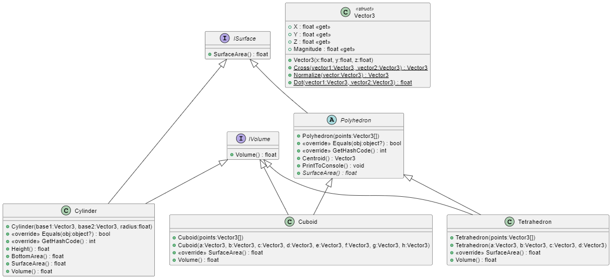

# Report for assignment 3

Assignment 3 is split in 2 parts
- Part 1: GeometryLibrary
- Part 2: Computation

# GeometryLibrary

I developed the GeometryLibrary using a Test Driven Development Strategy. The tests I used can be found in the "GeometryLibraryTests" project. I opted to start by creating a Vector3 struct to revise my knowledge in Linear algebra and vector calculus. In a real world application it would be advised to use the Vector3 struct available in `System.Numerics`.

## Interfaces
I identified that all my classes will provide a `Volume()` and a `SurfaceArea()` function which I decided to enforce by using interfaces. Since it was not required for the Tetrahedron class to have the `Volume()` function I split it into 2 interfaces `ISurface` and `IVolume`.

## abstract class Polyhedron
I created this class as it allowed me to reuse the `Centroid()` and equality functionality for both Cuboids and Tetrahedra since they are the same procedure. Both `Tetrahedron` and `Cuboid` inherit this class.

## Tetrahedron

I implemented a Tetrahedron as 4 points in space represented using my `Vector3` struct. To implement both surface and volume calculations I used my knowledge of vectors and the fact that a tetrahedron consists of 4 triangles.

## Cuboid

I implemented a Cuboid as 8 points in space represented using my `Vector3` struct. The order of the given points is important and it is interpreted to be in order (a-h). I initially tried to implement some checks for correctness but opted against it since it is beyond the timeframe I have to implement this right now. To solve for surface I use the fact that a cuboid consists of triangles. The volume I solve by splitting the cuboid into 5 tetrahedra and using the already implemented volume calculation of the Tetrahedron class.

## Cylinder 
Compared to the other 2 classes the Cylinder class is quite simple. It implements both `ISurface` and `IVolume` and uses simple vector calculations and circle formulas to solve both surface and volume. The height in my case is the distance between the 2 points describing the positions of the cylinders bases. This implementation does not allow to rotate the cylinder in space. The normal of the bases is always treated as pointing in the same directions as (0, 0, 1).

## UML

# Computation
The computation part of the assignment uses the GeometryLibrary

My implementation creates 5 Tetrahedra, 5 Cuboids and 5 Cylinders to a `List<ISurface>` shuffles the list and then calculates and prints all objects' surface areas. When it detects that an object is a Tetrahedra it sorts all of them in order.